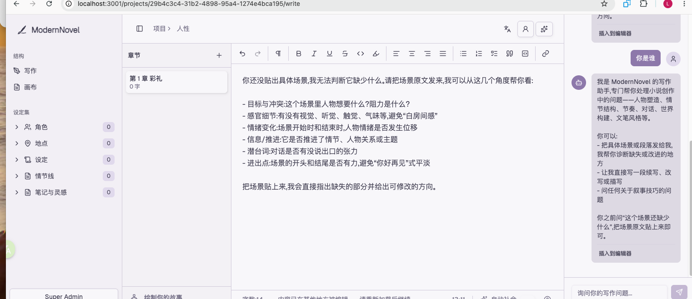
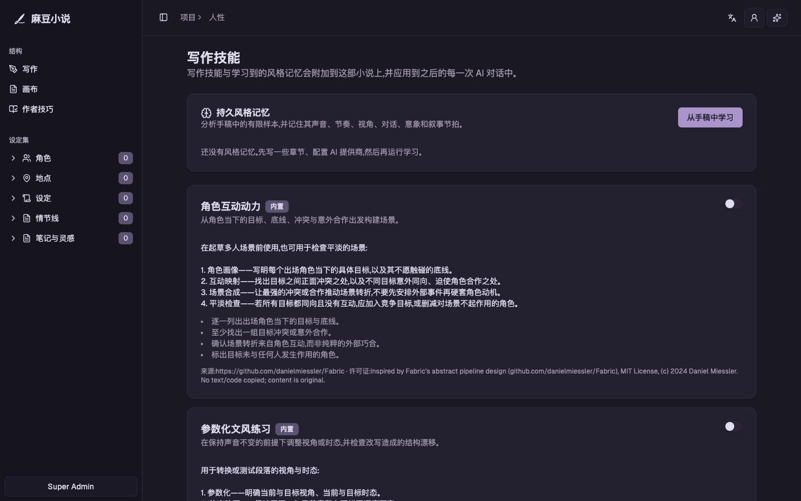
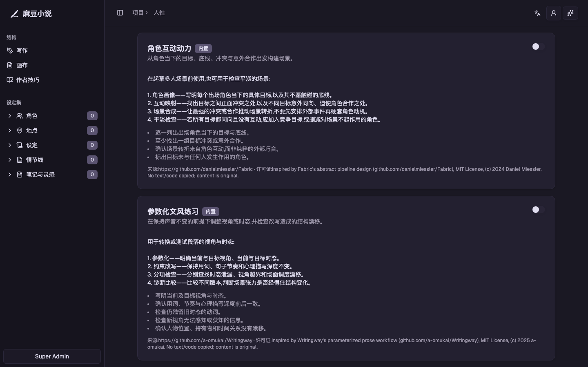
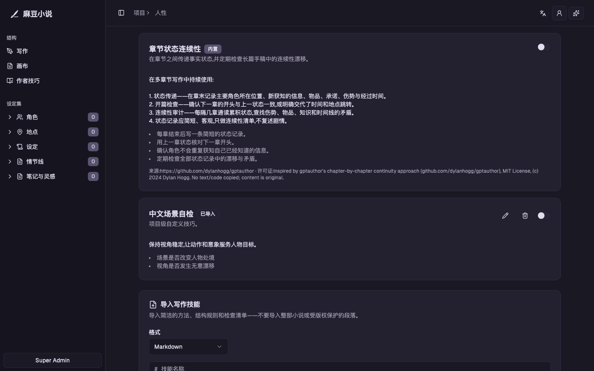
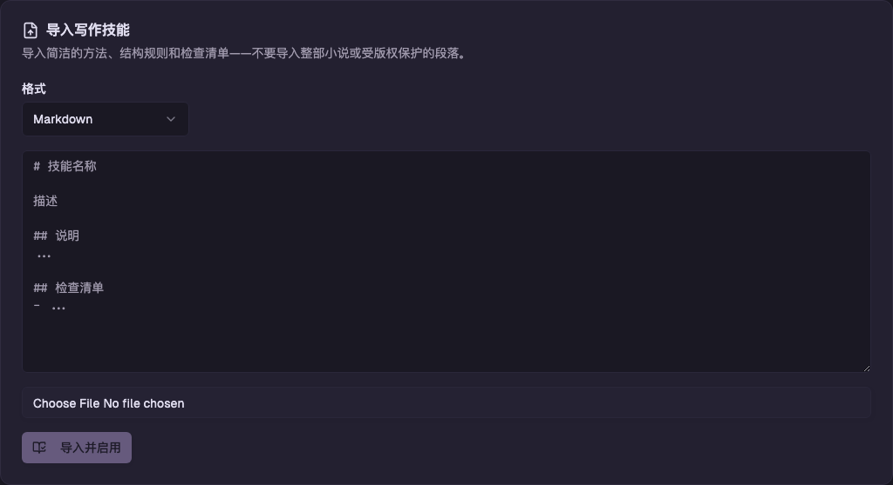

# 麻豆小说（ModernNovel）

> 一个为中文长篇小说创作设计的开源 AI 工作台。

[在线体验](https://modernnovel.zongyangpolo.workers.dev) ·
[健康检查](https://modernnovel.zongyangpolo.workers.dev/api/health) ·
[部署说明](#部署到-cloudflare)

[](LICENSE.md)


麻豆小说是一个可自行部署的中英文 AI 长篇小说创作平台。它把章节编辑、人物与地点设定、故事画布、项目级作者技巧、持久风格记忆和 AI 助手放进同一个 Workspace，支持 Kimi、DeepSeek、通义千问、MiniMax、OpenAI、Claude、Gemini、OpenRouter 和本地 Ollama。

> 当前版本适合作为个人创作工具、团队内部系统或二次开发基础。项目仍处于 POC 阶段，正式公开运营前请补充邮箱验证、机器人防护、监控告警和更严格的安全策略。

<p align="center">
  
</p>

上图展示了中文写作界面：左侧维护章节和小说设定，中间使用富文本编辑器写作，右侧 AI 助手可以结合当前作品上下文给出续写、修改和结构建议。

## 为什么做麻豆小说

通用聊天工具很难持续理解一部长篇小说。麻豆小说把作品资料和 AI 能力绑定到项目中，让中断数天或数周后的创作仍能沿用同一套人物设定、写作规则和叙述风格：

1. 创建小说项目，整理题材、简介和基础设定。
2. 在 Story Canvas 中拆分幕、章节和场景。
3. 在 Codex 中持续维护人物、地点、世界观和情节线。
4. 为整本小说启用 Writer Skills，并从已有正文学习项目风格。
5. 在编辑器中写作，让 AI 助手读取项目上下文并提供辅助。

## 核心能力

| 能力 | 当前实现 |
| --- | --- |
| 长篇项目管理 | 支持小说、系列、短篇集、剧本等作品类型 |
| 章节编辑 | Tiptap 富文本、自动保存、字数统计、并发修改检测、Markdown 导出 |
| Story Canvas | 从故事前提扩展幕、章节和场景，并将节点提升为正式章节 |
| 小说设定库 | 管理人物、地点、世界观、情节线、笔记与灵感 |
| AI 写作助手 | 自动注入项目、人物、Writer Skills 和风格记忆 |
| Writer Skills | 项目级启停、编辑、Markdown/JSON 导入和三套内置方法 |
| 持久风格学习 | 从正文提炼声音、节奏、视角、对话、意象和避免项 |
| 国产模型 | Kimi、DeepSeek、通义千问、MiniMax |
| 国际模型 | OpenRouter、OpenAI、Anthropic、Gemini、Groq、Cohere |
| 本地模型 | Ollama 服务地址与默认模型网页配置 |
| 中英文界面 | 自动识别浏览器语言、手动切换并持久保存 |
| Workspace | 成员邀请、角色权限和活动 Workspace 切换 |
| 系统管理 | 固定超级管理员、用户列表、禁用账号、查看全部 Workspace |
| Cloudflare | Worker 托管 API 与静态资源，D1 保存业务数据 |
| 数据保护 | AI Key AES-GCM 加密、D1 Time Travel、SQL 导出与恢复脚本 |

## 技术架构

```text
Browser
  └─ React 19 + TanStack Router + TanStack Query + shadcn/ui
       └─ /api/*
            └─ Hono on Cloudflare Workers
                 ├─ Better Auth
                 ├─ Cloudflare D1 + Drizzle ORM
                 ├─ Cloudflare Email
                 └─ AI Provider / Ollama
```

生产环境由一个 Cloudflare Worker 同时提供 API 和前端静态资源。小说正文、章节、项目资料、用户、Session、Workspace、Writer Skills、风格记忆和加密后的 AI Key 均保存在 D1；代码仓库不会保存用户小说数据。

## 快速开始

### 环境要求

- Bun 1.3+
- Node.js 22+
- Cloudflare Wrangler
- 可选：Ollama

### 安装依赖

```bash
git clone git@github.com:zongyangbigpolo/ModernNovel.git
cd ModernNovel
bun install
```

### 本地环境变量

```bash
cp apps/server/.dev.vars.example apps/server/.dev.vars
cp apps/web/.env.example apps/web/.env
```

`apps/server/.dev.vars`：

```dotenv
CORS_ORIGIN="http://localhost:3001"
BETTER_AUTH_URL="http://localhost:3000"
BETTER_AUTH_SECRET="至少 32 位的本地随机字符串"
ENCRYPTION_KEY="base64 编码的 32 字节密钥"
ADMIN_EMAIL="zongyangpolo@gmail.com"
ADMIN_PASSWORD="至少 6 位的本地管理员密码"
NODE_ENV="development"
```

生成密钥：

```bash
openssl rand -base64 32
```

`apps/web/.env`：

```dotenv
VITE_SERVER_URL="http://localhost:3000"
```

以上两个文件均已加入 `.gitignore`，不要提交真实密码或 API Key。

### 初始化本地 D1

```bash
cd apps/server
bunx wrangler d1 migrations apply DB --local
cd ../..
```

### 启动

```bash
bun dev
```

- Web：http://localhost:3001
- API：http://localhost:3000
- 健康检查：http://localhost:3000/api/health

也可以分别启动：

```bash
bun dev:web
bun dev:server
```

## 账号与权限

### 普通用户

- 使用邮箱和至少 6 位密码注册。
- POC 默认不要求邮箱验证。
- 首次注册自动建立个人 Workspace，并成为 owner。

### Workspace 角色

| 角色 | 权限 |
| --- | --- |
| `owner` | Workspace 完整控制权，管理成员与角色 |
| `admin` | 邀请及管理普通成员 |
| `member` | 使用 Workspace 中的创作功能 |

在 Dashboard 顶部可以切换当前 Workspace，在 **Team** 页面邀请成员、接受邀请和调整角色。

### 超级管理员

固定管理员邮箱为 `zongyangpolo@gmail.com`。服务启动后会使用 `ADMIN_PASSWORD` 幂等创建或提升该账号，密码只来自环境变量，不写入源码。

超级管理员在 **Administration** 页面可以：

- 查看全部用户。
- 启用或禁用用户；禁用时立即撤销该用户现有 Session。
- 查看全部 Workspace 及成员数量。

## 配置 AI API

AI Key 不需要写入命令行配置文件。登录后打开：

```text
Dashboard → AI Models → Connect
```

选择 Provider，填写 API Key 后保存。Key 会使用 `ENCRYPTION_KEY` 通过 AES-GCM 加密后存入 D1，API 不会把明文 Key 返回浏览器。

### Provider 支持情况

| Provider | 配置方式 | 当前默认模型 |
| --- | --- | --- |
| OpenRouter | OAuth PKCE 或手动 API Key | `openrouter/auto` |
| Kimi / Moonshot AI | API Key、模型 ID、API 地址 | `kimi-k3` |
| DeepSeek | API Key、模型 ID、API 地址 | `deepseek-v4-pro` |
| 通义千问 / Qwen | API Key、模型 ID、API 地址 | `qwen3.8-max` |
| MiniMax | API Key、模型 ID、API 地址 | `MiniMax-M3` |
| OpenAI | API Key、模型 ID、API 地址 | `gpt-5.6` |
| Anthropic | API Key、模型 ID | `claude-sonnet-5` |
| Groq | API Key | `llama-3.3-70b-versatile` |
| Gemini | API Key、模型 ID、API 地址 | `gemini-3.6-flash` |
| Cohere | API Key | `command-r-08-2024` |
| Ollama | 服务 URL、模型 ID，无需 Key | `qwen3` |

连接 Provider 时可在网页中直接选择或输入默认模型。生成时的模型优先级为：请求显式传入的 `model`、网页保存的默认模型、服务端内置默认模型。当前 AI 聊天页面会使用第一个启用的 Provider，若存在 `isDefault` Provider 则优先使用它。

### OpenRouter

1. 在 OpenRouter 创建 API Key，或使用页面提供的 OAuth 连接。
2. 进入 **AI Models**。
3. 选择 OpenRouter。
4. 完成 OAuth，或切换到手动 API Key。
5. 创建项目，在写作页面打开 AI 助手测试。

### Kimi / DeepSeek / 通义千问 / MiniMax

四家服务均通过 OpenAI-compatible Chat Completions 接口接入。网页会提供推荐模型和默认地址，也允许按账户地区、Workspace 或网关配置修改：

| Provider | 默认地址 | 可选地址或注意事项 |
| --- | --- | --- |
| Kimi | `https://api.moonshot.cn/v1` | 国际站可改为 `https://api.moonshot.ai/v1` |
| DeepSeek | `https://api.deepseek.com` | 可填写完整 `/chat/completions` 地址 |
| 通义千问 | `https://dashscope.aliyuncs.com/compatible-mode/v1` | 新版或企业账户可填写地域/Workspace 专属地址 |
| MiniMax | `https://api.minimaxi.com/v1` | 国际站可改为 `https://api.minimax.io/v1` |

国内站与国际站的 API Key 通常不可混用，应选择 Key 创建地区对应的地址。ModernNovel 会自动补全 `/chat/completions`，填写完整地址时不会重复追加。

### OpenAI / Anthropic / Groq / Gemini / Cohere

1. 从对应平台创建 API Key。
2. 在 **AI Models** 选择 Provider。
3. 粘贴 Key 并连接。
4. 不要把 Provider Key 放入 `.env`、README 或 GitHub Secrets；它属于用户级数据，应由网页保存。

### Ollama

本地启动 Ollama：

```bash
ollama serve
ollama pull qwen3
```

在 **AI Models → Ollama** 中填写服务地址和已经通过 `ollama pull` 安装的模型 ID：

```text
http://localhost:11434
```

ModernNovel 通过 Ollama 的 OpenAI-compatible `/v1/chat/completions` 接口调用模型。

注意：部署在 Cloudflare Worker 后，Worker 中的 `localhost` 不是你的电脑。生产环境若要使用家中或局域网的 Ollama，需要提供受保护的公网 HTTPS 地址、Cloudflare Tunnel 或独立模型网关；不要把无鉴权的 Ollama 端口直接暴露到公网。

## 作者技巧、风格记忆与持续学习

作者技巧（Writer Skills）不是一次性聊天提示词，而是绑定到小说项目的长期创作规则。启用后，系统会在每次项目 AI 对话前自动加载这些规则；退出登录、关闭浏览器或中断创作后仍然有效。

### 功能总览

打开小说后进入：

```text
项目编辑器左侧 → 作者技巧
```

在这里可以：

- 启用或停用内置 Skill。
- 导入自己的 Markdown/JSON Skill；导入后自动绑定并启用到当前小说。
- 编辑或删除自己创建的 Skill。
- 点击 **从手稿中学习**，从当前小说章节生成持久风格档案。

Skill 与风格档案都存入 D1，并通过 `project_id` 绑定小说。关闭浏览器、退出登录或中断几个月后再次写作，后续 AI 对话仍会自动加载同一组规则和风格记忆。

<p align="center">
  
</p>

#### 持久风格记忆

系统从已有章节的有限样本中提炼叙述声音、句式节奏、视角与时态、对话、意象、叙事节拍和避免项。学习结果保存在项目中，并在后续 AI 对话中持续注入，而不是只存在于当前聊天窗口。

### 三套内置 Skill

内置内容是原创规则，没有复制第三方提示词或小说原文，只借鉴了 MIT 项目的抽象工作流：

| Skill | 用途 | 灵感来源 |
| --- | --- | --- |
| Character Interaction Dynamics | 从人物欲望、压力点与互补关系组织场景冲突 | [Fabric](https://github.com/danielmiessler/Fabric)，MIT |
| Parameterized Prose Practice | 固定 POV/时态并进行视角、动作和语言泄漏检查 | [Writingway](https://github.com/a-omukai/Writingway)，MIT |
| Stateful Chapter Continuity | 维护章节间人物、地点、物件、承诺和未解决线索状态 | [gptauthor](https://github.com/dylanhogg/gptauthor)，MIT |

来源 URL、许可证说明和版权归属会随 Skill 一起显示。

<p align="center">
  
</p>

#### 项目级启用与自定义

每个 Skill 都有独立开关。内置 Skill 可以按小说启停；用户导入的 Skill 还可以继续编辑或删除。下图同时展示了长篇连续性检查和项目自定义的“中文场景自检”。

<p align="center">
  
</p>

### 导入自己的作者技巧

网页支持直接粘贴 Markdown/JSON，也可以选择本地文件。建议导入抽象写作方法、结构规则和检查清单，不要导入整本小说、长篇版权原文或要求模型复刻某位在世作家的独特风格。

<p align="center">
  
</p>

#### Markdown 格式

一级标题和 `Instructions` 必填：

```markdown
# 中文悬疑节奏

让线索、误导和代价升级贯穿整本小说。

## Instructions
每个场景明确人物目标、阻力和信息增量。线索首次出现时保持自然，
后续至少产生一次合理但错误的解释。

## Checklist
- 章节是否带来新信息或改变旧信息的含义
- 误导是否建立在角色认知而非作者隐瞒上
- 结尾是否保留未完成动作、认知反转或代价升级

## Examples
- 用人物的错误判断产生误导，而不是省略其已经知道的事实

## Source
- URL: https://example.com/your-authorized-source
- License: CC-BY-4.0
```

JSON 格式支持 `name`、`description`、`instructions`、`checklist`、`examples`、`sourceUrl` 和 `sourceLicense`。单个导入文件上限 20KB；服务端会删除 HTML 和控制字符，并限制字段、列表和注入 Prompt 的长度。

更适合把资料整理成通用技巧、结构规则、自检清单和少量自有示例，并记录来源及授权状态。

### 持久学习机制

风格学习借鉴 [Hermes Agent](https://github.com/NousResearch/hermes-agent)（MIT）的“持久记忆 + 每轮上下文注入”思路，但使用面向小说项目的 D1 实现：

1. 从当前项目最多 20 章中提取有界样本，每章最多 4,000 字符，总计最多 16,000 字符。
2. 使用当前用户已经配置的 AI Provider 生成严格结构化风格档案。
3. 验证并持久化声音、句式节奏、视角/时态、对话、意象、节奏和避免项。
4. 每次项目 AI 对话前，按确定顺序注入项目资料、已启用 Skill 和风格记忆。
5. 保存来源章节、字数、模型、Provider 和版本，方便知道记忆从何而来。

学习需要至少 200 字符的小说正文以及一个可用 AI Provider。为避免在自动保存时产生不可控模型费用，当前由用户手动点击学习；小说风格发生明显变化后可以再次运行，系统会更新同一份项目记忆。

## 部署到 Cloudflare

麻豆小说采用单 Worker 部署：Vite 先构建前端，Wrangler 再把 Hono API 和 `apps/web/dist` 静态资源一起发布。生产数据存储在 Cloudflare D1，模型请求由 Worker 直接调用用户配置的 Provider。

### 部署前准备

- 一个 Cloudflare 账号。
- 已安装 Bun 1.3+ 和 Node.js 22+。
- 一个准备绑定的域名；也可以先使用 `*.workers.dev` 地址。
- 用于超级管理员的邮箱和强密码。
- 三个互不相同的生产 Secret：`BETTER_AUTH_SECRET`、`ADMIN_PASSWORD`、`ENCRYPTION_KEY`。

### 1. 登录并创建 D1

```bash
cd apps/server
bunx wrangler login
bunx wrangler d1 create madou-novel
```

把命令输出的 `database_id` 填入 `apps/server/wrangler.jsonc` 的 `d1_databases`：

```jsonc
{
  "d1_databases": [
    {
      "binding": "DB",
      "database_name": "madou-novel",
      "database_id": "替换为真实 database_id",
      "migrations_dir": "src/db/migrations"
    }
  ]
}
```

### 2. 配置公开变量

在 `apps/server/wrangler.jsonc` 中加入：

```jsonc
"vars": {
  "NODE_ENV": "production",
  "ADMIN_EMAIL": "zongyangpolo@gmail.com",
  "CORS_ORIGIN": "https://你的域名",
  "BETTER_AUTH_URL": "https://你的域名"
}
```

如果暂时使用 Workers 默认域名，请把两个 URL 都改为实际的 `https://<worker-name>.<subdomain>.workers.dev`，不要保留示例地址。

### 3. 创建生产 Secret

先生成两个随机值：

```bash
openssl rand -base64 48 # BETTER_AUTH_SECRET
openssl rand -base64 32 # ENCRYPTION_KEY
```

然后在 `apps/server` 目录中逐个录入，Wrangler 会安全上传且不会把值写进仓库：

```bash
bunx wrangler secret put BETTER_AUTH_SECRET
bunx wrangler secret put ADMIN_PASSWORD
bunx wrangler secret put ENCRYPTION_KEY
```

如果需要邀请邮件和密码重置，还必须在 Cloudflare 配置 Email Sending，并把发件地址修改为已验证域名。邮箱验证在当前 POC 中默认关闭。

### 4. 初始化生产数据库

```bash
bunx wrangler d1 migrations apply DB --remote
```

第一次部署前必须完成迁移，否则注册、登录和项目接口会因为缺少数据表而失败。

### 5. 构建并部署

```bash
cd ../..
bun deploy
```

Worker 会同时部署 API 和 `apps/web/dist` 静态资源。

### 6. 绑定域名

在 Cloudflare Dashboard 中打开 **Workers & Pages → 你的 Worker → Settings → Domains & Routes**，添加自定义域名。绑定后同步修改：

- `apps/server/wrangler.jsonc` 中的 `CORS_ORIGIN`。
- `apps/server/wrangler.jsonc` 中的 `BETTER_AUTH_URL`。
- Better Auth 或 OAuth Provider 中配置的回调地址。

重新执行 `bun deploy` 让配置生效。

### 7. 部署后检查

1. 打开 `https://你的域名/api/health`，确认 Worker 和 D1 可访问。
2. 使用 `ADMIN_EMAIL` 与 `ADMIN_PASSWORD` 登录。
3. 创建测试项目并输入一段正文，确认自动保存正常。
4. 在 **AI 模型** 页面连接一个 Provider，不要把 Key 写入环境文件或仓库。
5. 在 Cloudflare D1 控制台确认项目、章节和用户记录已经写入。
6. 立即执行一次 `bun db:backup`，验证备份权限和保存位置。

### 仓库更新后如何发布

#### 自动部署（推荐）

仓库中的 [`.github/workflows/deploy.yml`](.github/workflows/deploy.yml) 已配置为：

1. 代码推送到 `main`。
2. GitHub Actions 先执行 CI。
3. CI 全部通过后，自动执行 D1 迁移并部署 Cloudflare Worker。
4. 部署完成后请求线上 `/api/health`；健康检查失败则工作流失败。

需要在 GitHub 仓库的 **Settings → Secrets and variables → Actions** 中配置以下 Repository secrets：

| Secret | 用途 |
| --- | --- |
| `CLOUDFLARE_API_TOKEN` | Cloudflare API Token，需要 Workers Scripts 和 D1 编辑权限 |
| `CLOUDFLARE_ACCOUNT_ID` | Cloudflare Account ID；本项目为 `2698d39b7eea23d2780a04987ea12020` |

`BETTER_AUTH_SECRET`、`ADMIN_PASSWORD` 和 `ENCRYPTION_KEY` 已直接保存在 Cloudflare Worker Secrets 中，后续部署会保留它们，不要在 GitHub 中重新生成或覆盖。

配置一次后，日常更新流程就是：

```bash
git add -A
git commit -m "feat: describe your change"
git push origin main
```

可以在 GitHub 仓库的 **Actions → Deploy ModernNovel** 查看部署进度，或通过 `workflow_dispatch` 手动重新部署。生产地址保持不变：

```text
https://modernnovel.zongyangpolo.workers.dev
```

#### 本地手动部署

如果暂时不使用 GitHub Actions：

```bash
git pull --rebase
bun install
bun run test
bun run check-types
bunx wrangler --cwd apps/server d1 migrations apply DB --remote
bun run build:web
bunx wrangler --cwd apps/server deploy
curl --fail https://modernnovel.zongyangpolo.workers.dev/api/health
```

不要在每次部署时重新生成 `ENCRYPTION_KEY`。更换它会导致 D1 中已有的 AI API Key 无法解密。

### Cloudflare 中的数据位置

| 数据 | 存储位置 |
| --- | --- |
| 用户、Session、Workspace、邀请 | Cloudflare D1 |
| 小说项目、章节和设定 | Cloudflare D1 |
| Writer Skills 与项目风格记忆 | Cloudflare D1 |
| AI Provider 配置 | Cloudflare D1 |
| AI API Key | AES-GCM 加密后存入 Cloudflare D1 |
| 前端静态资源 | Worker Assets |
| 生产 Secret | Cloudflare Workers Secrets |

Cloudflare D1 是 SQLite 兼容数据库。它不是浏览器本地存储，因此更换电脑或重新部署前端不会丢失小说；删除 D1 数据库、执行错误迁移或恢复操作则可能造成数据丢失，生产环境必须保留备份。

## D1 备份与恢复

D1 Time Travel 默认自动开启：

- Workers Free：通常保留 7 天。
- Workers Paid：通常保留 30 天。

额外导出 SQL：

```bash
bun db:backup
bun db:backup -- /secure/path/modernnovel.sql
```

恢复到时间点或 bookmark：

```bash
bun db:restore -- 2026-08-12T02:00:00Z
bun db:restore -- <bookmark>
```

恢复会覆盖生产数据库，脚本要求手动输入 `RESTORE`。长期备份应保存到加密存储，不能提交到 Git。

## 项目结构

```text
ModernNovel/
├─ apps/
│  ├─ web/       React 前端
│  ├─ server/    Hono Worker、D1 Schema、迁移和 API
│  └─ docs/      VitePress 文档
├─ e2e/          Playwright 测试
├─ package.json
└─ mprocs.yaml
```

## 常用命令

| 命令 | 用途 |
| --- | --- |
| `bun dev` | 启动 Web 和 Server |
| `bun dev:web` | 仅启动前端 |
| `bun dev:server` | 仅启动 Worker |
| `bun build` | 构建完整应用 |
| `bun run test` | 运行 Web 和 Server 测试 |
| `bun check-types` | TypeScript 检查 |
| `bun lint` | Biome 检查 |
| `bun quality` | 类型检查和 lint |
| `bun db:generate` | 生成 Drizzle 迁移 |
| `bun db:backup` | 导出远程 D1 |
| `bun db:restore -- <时间或 bookmark>` | Time Travel 恢复 |
| `bun deploy` | 构建并部署 Worker |

## 当前限制

- Writer Skill 当前只支持项目级绑定，尚无 Workspace 级共享库和语义检索。
- 风格记忆由用户手动刷新，尚未自动检测章节风格漂移。
- 网页端已支持 Provider 默认模型配置；单次请求的温度和最大 Token 配置尚未开放。
- Ollama 生产部署需要可由 Worker 访问的安全 HTTPS 网关。
- 团队成员可以共享 Workspace，但实时多人编辑尚未实现。
- 邮件发送依赖 Cloudflare 已验证的发件域名。
- DOCX、EPUB 和实时流式 AI 输出尚未完成。

## 安全说明

- 不要提交 `.dev.vars`、`.env`、D1 导出或真实 API Key。
- `BETTER_AUTH_SECRET`、`ADMIN_PASSWORD`、`ENCRYPTION_KEY` 必须使用 Cloudflare Secrets。
- 修改 `ENCRYPTION_KEY` 后，已有 AI Key 将无法解密。
- 不要在公网暴露无认证 Ollama。
- POC 未启用邮箱验证和机器人防护，公开运营前应补充相应措施。

## 测试

```bash
bun run test
bun check-types
bun lint
```

## License

[AGPL-3.0](LICENSE.md)
